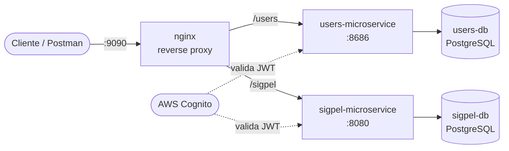

# SIGPEL — Proyecto Integrador (Arquitectura Empresarial)

**Integrantes:** Jean Mora, _(completar apellido Rivera con nombre completo)_
**NRC:** 1473
**Periodo:** 2026-01
**Proyecto:** SIGPEL — Sistema de Gestión de Préstamos de Equipos de Laboratorio
**URL desplegada:** _(completar si aplica, ej. `http://<IP_EC2>:9090`)_

---

## Arquitectura



- **nginx** es el único servicio con puerto publicado al host (`ports:`); todo lo demás usa `expose:` y solo es alcanzable dentro de la red interna de Docker Compose.
- Cada microservicio tiene **su propia base de datos** PostgreSQL, con credenciales y volumen independientes. Ninguno consulta la base del otro: si `sigpel` necesita datos de `users`, llamaría a su API (no lo hace hoy).
- Ambos microservicios validan el JWT de Cognito como Resource Server, resolviendo **el mismo issuer** (`AWS_REGION` + `COGNITO_USER_POOL_ID` compartidos vía `.env`).

## Estructura del repo

```
.
├── users/            # microservicio base (dado en clase), migrado de H2 a Postgres
├── sigpel/            # microservicio del dominio propio (préstamos de equipos)
├── nginx/             # reverse proxy: nginx.conf, proxy_headers.conf, html/
├── pgadmin/           # servers.json: pre-registra las dos conexiones de BD
├── docker-compose.yml
├── .env.example
└── README.md
```

## Cómo levantar todo

```bash
cp .env.example .env
# completar AWS_REGION y COGNITO_USER_POOL_ID reales del User Pool de Cognito
docker compose up -d --build
```

Verificar que todo esté `healthy`:

```bash
docker compose ps
```

- API pública: `http://localhost:${HOST_PORT:-9090}/users/...` y `http://localhost:${HOST_PORT:-9090}/sigpel/...`
- Explorador de BD (pgAdmin): `http://localhost:${PGADMIN_PORT:-5050}` — las dos conexiones (`users-db`, `sigpel-db`) ya vienen registradas (`pgadmin/servers.json`); solo pide la contraseña del `.env` la primera vez.
- Logs en vivo: `docker compose logs -f` (o `docker compose logs -f sigpel-microservice` para uno solo).

## Estándar de logging

Cada línea de log del microservicio `sigpel` sigue este formato fijo (ver `sigpel/src/main/resources/application.yml`):

```
<timestamp> | <LEVEL> | <servicio> | sub=<cognito-sub|anonimo> | <logger> | msg=<mensaje>
```

- `RequestLoggingFilter` (`sigpel/.../config/RequestLoggingFilter.kt`) pone el `sub` del JWT en el MDC y deja una línea `event=http.request` al entrar y `event=http.response` (con el código HTTP) al salir de **cada** petición.
- `LoggingAuthenticationEntryPoint` cubre el caso 401 (sin token), que ocurre antes de que el filtro anterior pueda ejecutarse.
- Eventos de negocio (`event=loan.requested`, `event=loan.status_changed`, `event=category.rejected`, `event=incident.registered`, etc.) están agregados en los métodos principales de cada `Service` — no en todos, priorizando los flujos que se demuestran en Postman.
- SQL de cada petición, con parámetros: `org.hibernate.SQL=DEBUG` + `org.hibernate.orm.jdbc.bind=TRACE` en `application.yml`, y `log_statement=all` en ambas bases (ver `docker-compose.yml`).
- Auditoría de la entidad principal (`Loan`): tabla `loan_audit` (quién, qué cambio de estado, cuándo) — `sigpel/.../entities/LoanAudit.kt`.
- No se loguean contraseñas, tokens completos ni datos personales sin enmascarar.

`users/` todavía usa el logging por defecto de Spring Boot — no se le aplicó este mismo estándar.

## Tests y cobertura

- `sigpel/`: tests unitarios (MockK) por servicio — `cd sigpel && ./gradlew test`.
- `users/`: tests unitarios (Mockito) + prueba de contexto — `cd users && ./gradlew test`.
- **Pendiente:** medir cobertura con el coverage del IDE (o JaCoCo) y adjuntar captura; agregar tests de integración (`@SpringBootTest`/`MockMvc`) que verifiquen 401 sin token y 403 con rol incorrecto a nivel HTTP.

## Colección de Postman

`sigpel/SIGPEL API - Demo.postman_collection.json` — **ojo:** hoy apunta directo al backend `sigpel` (`{{base_url}}/categories`, etc.), no a través de nginx. Falta actualizarla para pasar por `http://localhost:9090/sigpel/...` y agregar aserciones (`pm.test`) además de flujos de `users`.

## Mapeo con la rúbrica

| Criterio | Estado |
|---|---|
| 1. Monorepo (users + nginx + sigpel) | Hecho: las dos bases, healthchecks, `service_healthy`/`service_started` |
| 2. Logging de BD y de lógica | Hecho en `sigpel/`; falta replicar en `users/` |
| 3. Explorador de BD | Hecho: pgAdmin con las dos conexiones pre-registradas |
| 4. Logs a la mano | Hecho: `docker compose logs -f`, todo a stdout |
| 5. Entrega (nombre, 100%, ambos suben) | Nombre de repo sin el sufijo `_nombre_del_proyecto` — confirmar si hace falta corregirlo |
| 6. Tests al 100% | Parcial: tests unitarios existen, falta cobertura medida e integración HTTP |
| 7. Postman completo | Parcial: falta pasar por nginx y agregar aserciones |
| 8. Cognito auth/autorización | Hecho en `sigpel/` (roles, autorización por propiedad); `users/` solo exige token, sin roles diferenciados |
